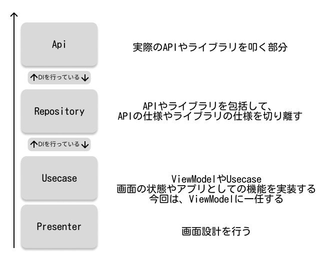

NationalWeather (お天気アプリ)
===

## 概要
全国の天気予報を取得したり、詳細の天気を取得したり、お気に入り保存をすることができるアプリです。

## バージョン関係
- kotlinCompilerExtensionVersion 1.5.4
- org.jetbrains.kotlin.android 1.9.20
- Java 17
- Android Studio Hedgehog | 2023.1.1 Patch 2

## 機能
- 全国の天気予報を取得
- 詳細の天気を取得
- お気に入り保存

## お天気API
以下のライブラリを使用している。
なぜか、温度がnullになる時があるバグが発生しているため、いずれ変更を行いたい。
https://weather.tsukumijima.net/

## 主なライブラリ構成
- Retrofit2
  - 通信ライブラリ
- moshi
  - JSONパーサー
- Room
  - ローカルデータベース
- Jetpack Compose
  - UIライブラリ
- coil
  - 画像ローダーライブラリ
- navigation-compose
  - ナビゲーションライブラリ
- lifecycle-viewmodel-compose
  - ViewModelライブラリ
- material-icons-extended
  - アイコンライブラリ

## アーキテクチャ
- MVVM + Clean Architectureを採用
- FeatureFirstのディレクトリ構成で行った

## CI/CDについて
- GitHub Actionsを使用してやっていきたいが、まだ設定していない
- Api・Repository間、Repository・UseCase間はDIを行っているためMock化も容易に行える

